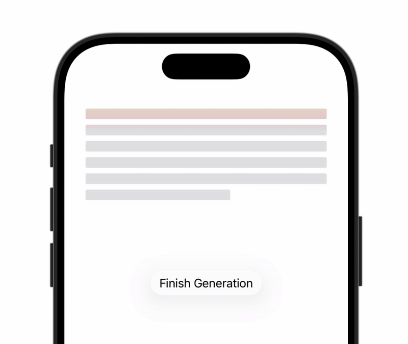

# AITextPlaceholder

## Overview
`AITextPlaceholder` is a SwiftUI component to display skeleton placeholder lines while AI-generated text is being produced. While generating, it shows stacked rounded rectangles with a vertical rainbow shimmer. When generation completes, your content replaces the placeholder and receives a one-time vertical shimmer in the opposite direction.

## Preview


## Basic Usage
```swift
import AppleIntelligenceForSwiftUI
import SwiftUI

struct ContentView: View {
    @State private var isGenerating = true
    @State private var generated: String = ""

    var body: some View {
        AITextPlaceholder(isGenerating: isGenerating, lineCount: 4) {
            Text(generated)
                .font(.body)
                .foregroundStyle(.primary)
        }
        .padding()
    }
}
```


## Convenience Initializer for Text
```swift
AITextPlaceholder(
    generatedText: generated,
    isGenerating: isGenerating,
    lineCount: 3
)
```

## Customization
```swift
AITextPlaceholder(
    isGenerating: isGenerating,
    lineCount: 5,
    lineHeight: 10,
    lineSpacing: 6,
    cornerRadius: 4,
    placeholderColor: .gray.opacity(0.2),
    highlightColor: .white.opacity(0.7)
) {
    Text(generated)
        .font(.callout)
}
```

Notes:
- The shimmer colors are rainbow with moderate intensity; adjust by changing per-color opacity in the gradient if desired.
- Entrance and finish animations are tuned to feel quick and fluid; you can tweak the spring `response` and `dampingFraction` in the implementation if you need a different feel.

