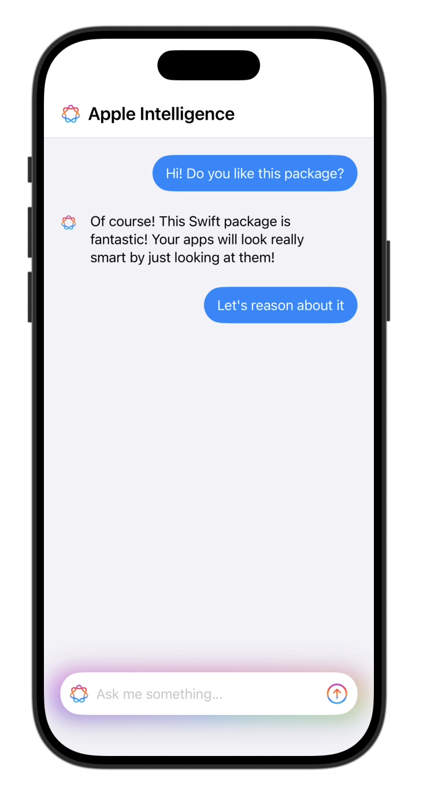

# AITextField

## Overview
`AITextField` is a SwiftUI component styled to resemble Apple's Siri/Apple Intelligence input field. It includes:
- A leading `apple.intelligence` symbol
- An animated, multi‑color glow with a subtle glass effect
- An optional trailing action button (arrow icon) that you can hook to your own action

## Preview


## Usage
Import the module and use `AITextField` in your SwiftUI view.

```swift
import AppleIntelligenceForSwiftUI

@State private var prompt: String = ""

var body: some View {
    AITextField(text: $prompt, placeholder: "Ask Siri…")
        .padding()
}
```

### With action button
```swift
import AppleIntelligenceForSwiftUI

@State private var prompt: String = ""

var body: some View {
    AITextField(
        text: $prompt,
        placeholder: "Ask Siri…",
        action: {
            // Send, submit, or trigger your custom logic here
            submit(prompt)
        }
    )
    .padding()
}
```

## Notes
- The component manages its own animated glow and glass effect; no extra modifiers are required.
- The trailing action button only appears when you pass a non‑nil `action`.
- Designed to work with standard SwiftUI layout and theming.
