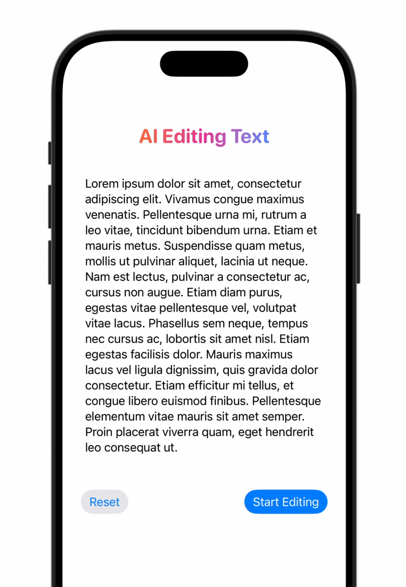

# AIEditingText

## Overview
`AIEditingText` is a SwiftUI view modifier that visually indicates when a text is being edited by intelligent models or agents. It applies an effect similar to the one used in Apple Intelligence writing tools, with a subtle opacity change, a moving highlight animation, and a wave effect when editing ends.

## Preview



## Usage
Apply the `.aiEditingText(when:)` modifier to any SwiftUI view, passing a `Binding<Bool>` that reflects the editing state.

```swift
import AppleIntelligenceForSwiftUI

@State private var isEditing = false

var body: some View {
    Text("Edit me!")
        .aiEditingText(when: $isEditing)
}
```

## Notes
- The modifier animates a white highlight over the text when `isEditing` is true.
- When editing ends, a bounce effect is triggered for visual feedback.
- You can use this modifier on any SwiftUI `View` to provide a consistent editing experience, but it's designed mainly to work with `Text` views.
