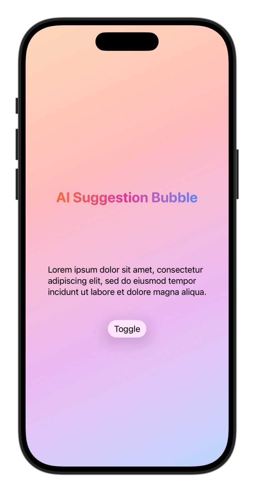

# AISuggestionBubble

## Overview
`AISuggestionBubble` is a SwiftUI modifier that displays AI-generated suggestions as a floating bubble popover overlay. It animates into view near the target element and supports tap interaction to dismiss and invoke an optional handler.

## Preview


## Usage
Import the module and apply the `.aiSuggestionBubble(isPresented:suggestion:onTap:)` modifier to your SwiftUI view. Provide a binding to control visibility, the suggestion text, and optionally a tap handler.

```swift
import AppleIntelligenceForSwiftUI

struct ContentView: View {
    @State private var isSuggestionPresented = false

    var body: some View {
        Button("Show Suggestion") {
            isSuggestionPresented = true
        }
        .aiSuggestionBubble(isPresented: $isSuggestionPresented, suggestion: "How can I help you today?") {
            print("Suggestion tapped")
        }
    }
}
